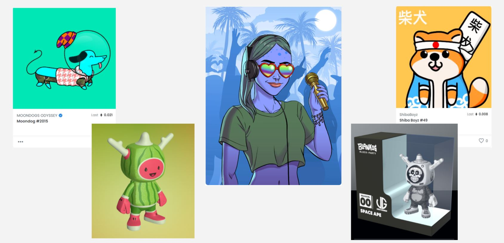

# Jingle Stamp NFT

## Summary

### Introduciton

The Gift Basket Collection is a NFT collection representing digital gift baskets. Each token has unique traits based on themes such as season and holiday. Each gift basket (GIFB) is an ERC721 token. When minted, traits are randomly generated using (placeholder)...

### Functions

#### createGiftBasket

Mints a Gift Basket. The gift basket contains a collection of christmas themed NFTs that are randomly generated. 

#### newAppraisal

Updates token value of a Gift Basket.

## Demo App

Click [here](frontend/index.html) to launch the Gift Basket NFT application.
